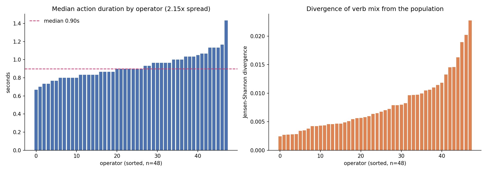
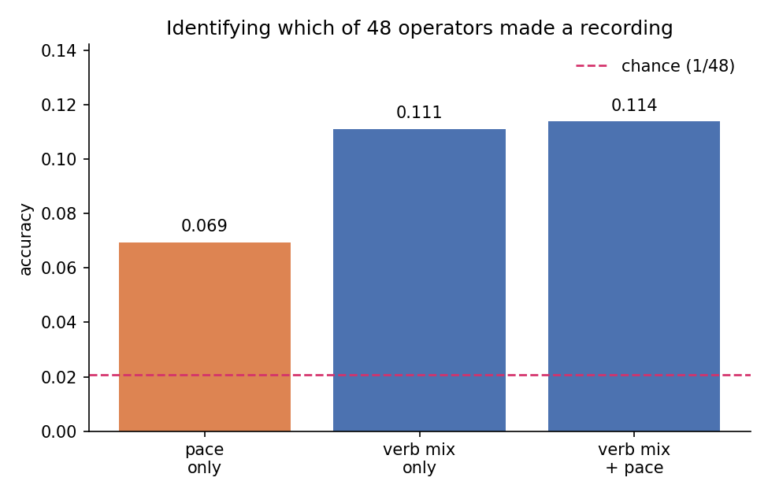
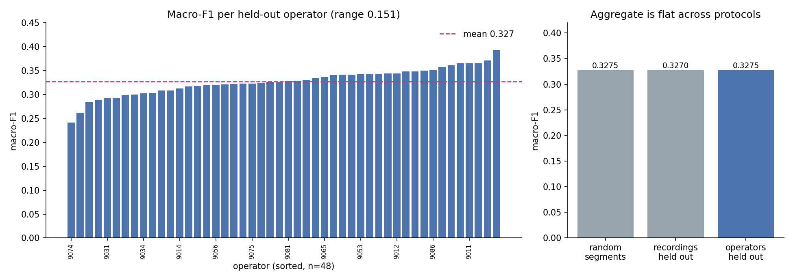

# Assembly101 Operator Variation


Measuring how much action recognition accuracy on assembly video depends on
having already seen the person doing the work.

---

## 📌 Overview

Benchmarks for procedural activity split data by recording or by object.
Segments from the same participant end up in both train and test, so a model
can learn one person's habits and get credit for it.

On a production line that credit disappears. A new operator starts, or an
existing one works differently after a shift change, and the model meets
someone it has never seen.

This repo measures that. Three findings so far. Assembly101's official splits
contain **no operator holdout at all**. Operator identity is **recoverable from
the label stream** before any appearance model is involved. And on procedural
structure alone the **aggregate gap is zero**, while individual operators still
differ by 15 points, which is the case for reporting per-operator scores rather
than a mean.

---

## 🎯 Status

| Component | State |
|---|---|
| Participant structure | Done, runs without dataset access |
| Data quality audit | Done, two issues found |
| Operator overlap in official splits | Done, measured |
| Operator variation from labels | Done, measured |
| Operator identification from labels | Done, measured |
| Split comparison on procedural structure | Done, measured |
| Per-operator spread | Done, measured |
| Evaluation harness | Done, 18 tests passing |
| Same comparison on TSM visual features | Blocked, access request pending |
| Qualitative review of worst operator | Blocked, needs video |

Everything marked done is measured on the real annotations, which are public.
The TSM feature store is gated, so the visual version of the comparison has
not run. The notebook watermarks any figure it produces from synthetic data.

---

## ❓ Why the standard benchmark misses this

Assembly101 splits recordings 60/15/25 for train, validation and test. The
splits are built around toy novelty: 25 of 101 toys are shared across all
three splits, with 20 and 16 unseen toys held out for validation and test.

Operator identity is not a controlled variable. Measured directly on the
annotations, all 48 operators appear in the training split and every single
validation and test recording belongs to one of them (see Results).

The benchmark answers whether a model generalises to a new product. It cannot
answer whether it generalises to a new person.

---

## 🔬 Method

Three protocols, matched on model, fold count and test set size. The only
thing that changes is what is allowed to appear on both sides of the split.

| Protocol | Split | Leaks |
|---|---|---|
| A | `KFold` shuffled over segments | Recording and operator |
| B | `GroupKFold` on recording | Operator only |
| C | `GroupKFold` on operator id | Nothing |

Two protocols would conflate two different leaks. Adding B means the operator
effect can be isolated: A to B measures the within-recording leak, B to C
measures the operator leak on its own.

Classifier is a standardised multinomial logistic regression. Keeping it simple
is intentional, since a stronger model moves every number and hides the gaps
being measured.

Two feature sets:

| Features | Question | State |
|---|---|---|
| Duration, gap, position, neighbouring actions | Is procedural structure operator dependent? | Done |
| Mean-pooled TSM visual features | Is appearance operator dependent? | Blocked on access |

Reported: macro-F1 per protocol, the two gaps, and the spread of per-operator
scores under protocol C.

---

## 📊 Results

Measured on the full fine-grained annotations: 1,013,523 annotation rows
collapsing to **84,255 physical segments**, **48 operators**, **24 verbs**.

### Operators are not held out at all

| | train vs validation | train vs test |
|---|---|---|
| Operators in both | 37 of 37 | 41 of 41 |
| Recordings from an operator seen in train | 62/62 (100%) | 88/88 (100%) |
| Segments from an operator seen in train | 15,603 (100%) | 21,759 (100%) |

Training contains all 48 operators. Every recording in validation and test
belongs to someone the model has already trained on. The split is not merely
non-disjoint in operators, it has no operator holdout whatsoever.

### Operators differ measurably

- Median action duration ranges **0.67s to 1.43s**, a **2.15x** spread between
  the fastest and slowest operator.
- Verb-mix divergence from the population ranges **0.0024 to 0.0227**, roughly
  a tenfold range in how idiosyncratic someone's action mix is.



### Operator identity is recoverable from labels alone

Predicting which of 48 operators produced a recording, from its verb histogram
and median action duration. No pixels involved.

| Features | Accuracy | vs chance |
|---|---|---|
| pace only | 0.069 | 3.3x |
| verb mix only | 0.111 | 5.3x |
| verb mix + pace | **0.114** | **5.5x** |
| chance | 0.021 | 1.0x |



The signal exists in the data before any appearance model sees it, and the
splits make it available on both sides.

### Split comparison on procedural structure

The visual features are still gated, so this runs the protocol comparison on
features derived from annotations only: action duration, gap to the previous
action, relative position in the recording, and the identity of the preceding
and following actions. **This is not the vision experiment.** It asks a
narrower question: is the *procedural structure* of the work operator
dependent?

Three protocols rather than two, so the leak can be decomposed. Holding out
recordings removes the within-recording leak but still lets the same person
appear on both sides. Holding out operators removes both. The difference
between those two isolates the operator effect.

| Protocol | Macro-F1 |
|---|---|
| Random segments | 0.3275 |
| Recordings held out | 0.3270 |
| Operators held out | 0.3275 |

| Decomposition | Gap |
|---|---|
| Within-recording leak | +0.0006 |
| Operator leak, isolated | -0.0005 |
| Total | +0.0001 |

**The aggregate gap is zero.** On procedural structure alone, a model
generalises to an unseen operator exactly as well as to a seen one.

### The mean hides the spread

| | |
|---|---|
| Per-operator mean | 0.327 |
| Standard deviation | 0.0285 |
| Worst | 0.241 (operator 9074) |
| Best | 0.393 (operator 9082) |
| Range | 0.151 |



A 15 point range between the hardest and easiest operator, under a protocol
whose aggregate says operator identity does not matter. A permutation test
shuffling which operator each recording belongs to, keeping group sizes fixed,
gives a null range of 0.097 on average. The observed range exceeds all 12
permutations, p = 0.077, which is the minimum achievable at 12 permutations,
so more would be needed to claim a conventional threshold.

### What this rules out

There are two candidate sources of an operator gap in a vision model: *what*
people do and when, or *how they look* doing it. This experiment isolates the
first and finds no aggregate effect. If the TSM experiment does show a gap, it
comes from appearance and motion style rather than from procedural structure.

### Still pending

| Metric | Value |
|---|---|
| Macro-F1 on TSM visual features, all three protocols | pending features |
| Per-operator spread on visual features | pending features |
| Qualitative review of the worst operator's footage | needs video access |

Reproduce all of the above with:

```bash
python annotation_analysis.py --ann-dir path/to/fine-grained-annotations
```

---

## 🔍 Data quality

Two problems, both found while building the operator grouping and both
invisible to anyone splitting by toy.

### Issue 1: camera views inflate the row count 12x

Each physical action is annotated once per camera. The `video` column carries a
view suffix, so train.csv holds 566,855 rows for 47,252 real segments. Splitting
randomly over rows puts the same physical action in train and test under two
different cameras, which is a second leak independent of the operator one.
`load_split` collapses views before anything else happens.

### Issue 2: conflicting operator ids

Recording names carry the operator id twice:

```
nusar-2021_action_both_9011-a01_9011_user_id_2021-02-01_153724
                       ^^^^     ^^^^
```

In 7 of 362 recordings the two ids disagree. Since the point of this study is
to keep a person's footage out of training, a wrong assignment puts back the
exact leak being measured.

**Alias, 6 recordings.** All carry `9065` first and `9095` second. `9095` never
appears as a primary id anywhere, so these six are one group either way and
only the label changes. Kept under `9065`.

**Unresolvable, 1 recording.**
`nusar-2021_action_both_9072-a14_9071_user_id_2021-02-11_104901` names `9072`
and `9071`. Both are real participants with their own recordings on that date,
so the filename gives no way to choose. Excluded rather than guessed. That is
0.28% of recordings, against the risk of putting one person's work into
training while holding that same person out.

Check it without downloading the dataset:

```bash
python check_participants.py
```

```
input recordings    362
recordings usable   361
participants        48
recordings/person   min 5  median 7  max 14
benign aliases      6
ambiguous, dropped  1
unparsed            0
```

---

## ⚙️ Design choices

**Verbs, not 1380 fine-grained actions.** Per-operator macro-F1 over 1380
classes is driven by classes where a person has one or two segments, so the
score moves on sampling noise instead of operator identity. 24 verbs give every
operator over a thousand segments, enough support per class to be stable.

**Each person scored on their own classes.** `participant_score` averages over
the classes that participant actually performs. Using the full label set would
penalise someone for classes missing from their ground truth, which measures
how varied their work is rather than how well the model handles them.

**Controls before results.** A positive control plants a known operator effect
and checks the harness finds it. A negative control removes the effect and
checks the gap goes away. Without both, the zero gap reported above would be
uninterpretable, since an instrument that cannot detect a gap also returns zero.

**A permutation null for the spread.** The per-operator range is compared
against shuffling which operator each recording belongs to, keeping group sizes
fixed. A range means nothing without knowing what an arbitrary grouping of the
same data produces.

**Second dataset.** `breakfast.py` runs the same harness on Breakfast
(52 subjects, around 33 videos each), whose official protocol is
subject-disjoint. Assembly101 controls for new objects and ignores operators.
Breakfast does the opposite.

---

## ⚡ Quick start

```bash
pip install -r requirements.txt

python check_participants.py           # no dataset access needed
python annotation_analysis.py --ann-dir path/to/fine-grained-annotations
pytest -q                              # harness controls
```

Full experiment: `assembly101_operator_variation.ipynb`. It detects
whether dataset access is available and falls back to a synthetic stand-in
with the same structure, watermarking every synthetic figure.

---

## 📁 Structure

Flat on purpose, so the layout survives any upload method.

```
participants.py           id parsing, alias and ambiguity handling
evaluation.py             three protocols, per operator scoring, spread
breakfast.py              MS-TCN format loader (Breakfast, 50Salads, GTEA)
check_participants.py     participant audit, no dataset access needed
annotation_analysis.py    overlap, variation and identification
test_participants.py      8 tests
test_evaluation.py        10 tests, positive and negative controls
results/                  figures and findings
DATA_INTEGRITY.md         notes on the two data issues
assembly101_operator_variation.ipynb
```

---

## 📄 Data and licence

Code is MIT. No dataset content is redistributed here.

Assembly101 is CC BY-NC 4.0 and obtained from the maintainers. This is a
personal, non-commercial project.

> Sener et al., *Assembly101: A Large-Scale Multi-View Video Dataset for
> Understanding Procedural Activities*, CVPR 2022.
